# 系統流程圖

## 三階段總覽

| 階段 | 任務 | 關鍵字 |
|------|------|--------|
| **Phase 1：記憶召回分析** | 讀取整個資料庫（世界觀 + 自我記憶 + 參與者記憶），從中篩選出 6-8 條最相關條目作為 Phase 2 的已知資訊 | **預處理**、**全庫掃描** |
| **Phase 2：角色扮演回覆** | 組裝提示詞（靜態指令在上、動態資料在下），呼叫 DeepSeek 生成角色回覆 | **生成**、**扮演** |
| **Phase 3：知識檢測與記憶維護** | 逐條比對 bot 回覆與完整資料庫，積極找出需要新增（learn）、更新（edit_self）、修正（edit_msg）之處。讓機器人不斷學習與成長的核心機制 | **更新**、**維護**、**讓 bot 活過來** |

```mermaid
flowchart TB
    subgraph 入口
        A["訊息送達
on_message()"] --> B{"是 Bot 自己？"}
        B -->|是| Z[忽略]
        B -->|否| C{"內容封鎖關鍵字？"}
        C -->|是| Z
        C -->|否| D{"是斜線指令？"}
        D -->|是| Z2[交 discord.py 處理\n不經 RP 流程]
        D -->|否| 階段1
    end

    subgraph 階段1["Phase 1：記憶召回分析 + 資料庫全讀"]
        direction TB
        1A["fetch_reply_chain()
        追蹤 Discord 回覆鏈"] --> 1B["讀取最近 30 則
        channel.history()"]
        1B --> 1C{"判斷 channel_type\n頻道名/主題關鍵字"}
        1C -->|"ic 關鍵字命中"| 1D[in_character\n記錄為 最後活躍 IC]
        1C -->|"ooc 關鍵字命中"| 1E[out_of_character]
        1C -->|"無關鍵字"| 1F[預設 IC\n但不記錄最後活躍]
        1D --> 1G["呼叫 run_phase1() 前
        先撈取完整資料庫：
        get_all_lore_full() → 所有世界觀完整內容
        get_self_memory_raw(50) → 所有自我記憶
        get_user_memory(每候選人 5 條) → 參與者記憶"]
        1E --> 1G
        1F --> 1G
        1G --> 1H["run_phase1()
        靜態指令（上方）+ 完整資料庫（底部）
        從全庫中選出 6-8 條最相關條目
        寫入 supplement（含條目 + 備註）
        輸出：recall / lore_topics / lore_notes / supplement"]
        1H --> 1I["補充撈取（Phase 2 已知資訊用）
        get_user_memory(recall_user_ids, limit=8)
        使用 Phase 1 的 supplement（若有）
        或降級舊式組裝（lore_entries + lore_notes）"]
    end

    subgraph 階段2["Phase 2：提示詞組裝 & 回覆生成"]
        direction TB
        2A["build_phase2_system_prompt()
        依 channel_type 建立基礎 prompt"] --> 2B{"OOC 還是 IC？"}
        2B -->|OOC| 2OOC["OOC 提示詞：
        - 中之人（扮演者）身份
        - 注入 ooc_persona 人設
        - 注入 ooc_chat_examples 範例
        - planning_template_ooc
        - 安全規則（無「以角色身分」）"]
        2B -->|IC| 2IC["IC 提示詞：
        - 角色本人身份
        - 文風規則 + 禁用詞
        - planning_template_ic
        - 社交原則 + 表情符號"]
        2OOC --> 2C
        2IC --> 2C
        2C["IC 頻道？"] -->|是| 2D["注入故事摘要
        get_channel_summary()
        → 【目前故事摘要】"]
        2C -->|否| 2H
        2D --> 2E{"托管模式開啟？"}
        2E -->|是| 2F["get_autopilot_injection()
        掃描最近 50 則訊息
        比對托管角色名稱
        載入角色資料+能力+記憶
        → 注入【⚠️ 托管模式啟用】"]
        2E -->|否| 2H
        2F --> 2G{"有在場托管角色？"}
        2G -->|否| 2H
        2G -->|是| 2G2["加入記憶標籤格式說明
        LEARN_CHAR / MEM_CHAR"]
        2G2 --> 2H["組裝 phase2_messages
        system prompt + 歷史訊息 + 格式指令 + 使用者訊息"]
        2H --> 2I["呼叫 DeepSeek API
        temperature=0.8, max_tokens=2048"]
        2I --> 2J["strip_japanese_original()
        「日文」（中文）→（中文）
        在文風自檢前執行"]
        2J --> 2K{"文風自檢模式？"}
        2K -->|enable_ic_style 或 IC| 2L["style_review()
        用 style rules 審查
        收到已清理版本無日文"]
        2K -->|否| 2M
        2L --> 2M["剝離 <planning> 區塊"]
        2M --> 2N["移除 MEM/LEARN 標籤"]
        2N --> 2P{"含 [TO:]？"}
        2P -->|是| 2Q["分段匹配使用者\nstartswith() 比對顯示名稱\n逐段 reply()"]
        2P -->|否| 2R["message.reply()
        發送 bot_reply"]
        2Q --> 2S["安全關鍵字過濾
        含 blocked_keywords → 安全回覆"]
        2R --> 2S
    end

    subgraph 階段3["Phase 3：知識檢測 + 記憶維護（核心：讓 bot 活過來）"]
        direction TB
        3A["asyncio.create_task()
        phase3_process()
        取得完整資料庫：
        get_self_memory(limit=200)
        get_all_lore_full()
        （不再只給最近 15 條）"] --> 3B{"原始回覆含
        [MEM:] / [LEARN:]？"}
        3B -->|是| 3C["解析 JSON 標籤
        save_user_memory()
        save_self_memory()"]
        3B -->|否| 3D
        3C --> 3D["知識檢測（新版積極比對）
        呼叫 DeepSeek API
        temperature=0.2
        輸入：完整資料庫（截斷放寬至5000字）
        任務：逐條比對 bot 回覆 vs 每條既有記憶
        預設輸出至少一個 action
        → learn / edit_self / mem / profile / forget / rule / edit_msg"]
        3D --> 3E["解析 JSON actions"]
        3E --> 3F["learn → save_self_memory()
        世界觀類同步寫入 world_lore"]
        3E --> 3G["mem → save_user_memory()"]
        3E --> 3H["edit_self → _update_memory()
        修正角色自身記憶"]
        3E --> 3I["forget → 標記可遺忘"]
        3E --> 3J["profile/profile_char
        → update_character_profile()"]
        3E --> 3K["rule → save_server_rule()"]
        3E --> 3L["edit_msg → _edit_bot_message()
        AI 輔助編輯"]
        3L --> 3M{"托管模式開啟？"}
        3K --> 3M
        3M -->|是| 3N["process_autopilot_memories()
        解析 LEARN_CHAR / MEM_CHAR
        寫入各角色獨立記憶 DB"]
        3M -->|否| 3O
        3N --> 3O{"IC 頻道？"}
        3O -->|是| 3P["update_channel_summary()
        增量合併故事摘要"]
        3O -->|否| 3Q
        3P --> 3Q{"_maint_trigger_count % 2 == 0？"}
        3Q -->|是| 3R["maintain_self_memories()
        AI 合併/簡化/刪除記憶
        嚴禁跨類別合併"]
        3Q -->|否| 3S
        3R --> 3S["有變動？
        寫入 memory_maintenance_logs/ 日誌"]
    end

    subgraph 指令["斜線指令模組"]
        direction TB
        CMD_say["/say
        指定角色發言"] --> CMD_sayP[呼叫 Phase 2\n省略 Phase 1]
        CMD_db["/db
        分頁檢視資料庫"] --> CMD_dbP[唯讀查詢]
        CMD_sum["/summarize
        手動生成劇情摘要"] --> CMD_sumP[呼叫 API\n存入記憶+日誌]
        CMD_rule["/addrule
        新增伺服器規則"] --> CMD_ruleP[寫入 DB]
        CMD_mod["修改建議
        右鍵→編輯訊息"] --> CMD_modP[AI 審查\n風格感知編輯]
        CMD_apon["/autopilot_on
        開啟托管模式"] --> CMD_aponP[寫入 config]
        CMD_apoff["/autopilot_off
        關閉托管模式"] --> CMD_apoffP[寫入 config]
        CMD_apadd["/autopilot_add
        表單新增托管角色
        含能力欄位"] --> CMD_apaddP[寫入 DB\n建立記憶 DB]
        CMD_aplist["/autopilot_list
        檢視+切換開關"] --> CMD_aplistP[UI 面板\n下拉選單 toggle]
        CMD_dbnpc["/dbnpc
        檢視托管角色記憶"] --> CMD_dbnpcP[分頁 + 下拉選角色]
        CMD_dbnpct["/dbnpc_teach
        自然語言教角色記憶"] --> CMD_dbnpctP[AI 自動填表]
        CMD_ge["/gods-eye
        神之眼解說"] --> CMD_geP[選頻道/討論串\nAI 旁白解析]
        CMD_read["/read
        角色閱讀討論串"] --> CMD_readP[下拉選/手動輸入\n分批讀取+記憶]
    end

    A --> 階段1 --> 階段2 --> 階段3
    A --> 指令

    style Z fill:#f88,stroke:#333
    style Z2 fill:#f88,stroke:#333
    style 1A fill:#e1f5fe,stroke:#0288d1
    style 2A fill:#fff3e0,stroke:#f57c00
    style 2I fill:#fff3e0,stroke:#f57c00,stroke-width:3px
    style 3A fill:#e8f5e9,stroke:#388e3c
    style 3D fill:#e8f5e9,stroke:#388e3c,stroke-width:3px
```



---

# 詳細文字說明

## 訊息入口

| 條件 | 行為 |
|------|------|
| Bot 自己的訊息 | 忽略（避免自我循環） |
| 含封鎖關鍵字 | 安全取代後發送 |
| 斜線指令 | 直接交 discord.py 處理，不走 RP 流程 |
| 一般訊息 | 進入 Phase 1 → 2 → 3 |

---

## Phase 1：記憶召回分析 + 資料庫全讀（Phase 2 的預處理）

Phase 1 的本質是 **「Phase 2 的前置預處理」**——它讀取整個資料庫，從中挑選出 Phase 2 當下最需要的資訊，而不是把所有原始資料塞給 Phase 2。

1. **fetch_reply_chain()** — 若使用者按 Discord 回覆，追蹤回覆鏈中的原始訊息（停在 Bot 訊息為止，避免鏈汙染）
2. **channel.history(limit=30)** — 讀取頻道最近 30 則訊息為上下文
3. **判斷頻道類型**（頻道名+主題關鍵字比對）：
   - IC 關鍵字命中 → `in_character` + 記錄為最後活躍 IC 頻道
   - OOC 關鍵字命中 → `out_of_character`
   - 未命中任何關鍵字 → 預設 IC（但不記錄最後活躍，避免污染跨頻道召回）
4. **呼叫 run_phase1() 前，先撈取完整資料庫**（全庫掃描，不做截斷）：
   - `get_all_lore_full()` — 所有世界觀條目的完整內容（category + topic + content）
   - `get_self_memory_raw(limit=50)` — 角色自我記憶（排除劇情摘要）
   - `get_user_memory(each candidate, limit=5)` — 每個候選參與者的記憶
5. **run_phase1()** — 記憶召回分析器，輸入包含完整資料庫：
   - 所有候選參與者
   - 最近對話歷史
   - **完整世界觀內容**（非僅目錄）
   - **完整角色自我記憶**（非僅摘要）
   - **完整參與者記憶**（非僅名稱）
   - 討論串目錄 + 任務資訊
   - Prompt 結構：**靜態指令在上方**，**完整資料庫內容在底部**
   - 輸出 JSON（`response_format: json_object`，`max_tokens=2000`）：

   | 欄位 | 用途 |
   |------|------|
   | `recall` | 要召回的參與者 ID 陣列（最多 3 人） |
   | `lore_topics` | 要召回的 world_lore 條目名稱 |
   | `recall_threads` | 相關的討論串名稱 |
   | `load_plot` | 是否為劇情相關對話 |
   | `enable_ic_style` | OOC 中是否啟用 IC 文風 |
   | `lore_notes` | 註釋陣列（可關聯條目或自由備註） |
   | `supplement` | **字串**，含 `<supplement>` 區塊，至少 6-8 條從全庫選出的相關條目 + 備註 |

6. **Phase 1 回傳後**：
   - 使用 `phase1_supplement` 作為 `lore_text` 直接送入 Phase 2（若無 supplement 則降級舊式組裝）
   - 另撈取 `get_user_memory(recall_user_ids, limit=8)` 作為 Phase 2 已知資訊

7. **Prompts 也記錄**：每次呼叫的完整 prompt → `last_phase1_prompt.txt`，response → `last_phase1_response.txt`

---

## Phase 2：提示詞組裝與回覆生成

### 2A. 系統提示詞建構

**OOC 頻道：**
```
【身分】中之人（扮演者），用自然現代人語氣
【中之人設定】ooc_persona（config.json 可調）
【中之人聊天語料範例】ooc_chat_examples（8 則，含打招呼/討論/玩笑/設定確認等）
【安全規則】無「以角色身分」措辭
【場景】頻道資訊 + OOC 跨頻道劇情補拉
【記憶】使用者記憶 + 角色自我認知
【世界觀】可選參考
【planning】planning_template_ooc → 快速判斷：
  - 對方角色還中之人？
  - 閒聊/討論/創作委託？
  - 該用什麼態度？
  - 有什麼話題可延伸？
【⚠️ 避免重複結構】不固定三段式
```

**IC 頻道：**
```
【角色扮演協議】jailbreak
【身份】角色本人，禁止用「我」
【安全規則】+【伺服器規則】+【社交原則】+【表情符號】
【文風規則】對話佔比 + 稱呼規則 + 表達偏好 + 禁用詞
【場景】頻道資訊
【記憶】使用者記憶 + 角色自我認知
【任務】任務資訊
【世界觀】引用回答，不編造
【planning】planning_template_ic → ：
  - 時間點/位置/空間關係/在場人物
  - 當前劇情主線與對方意圖
  - 角色性格連動與化學反應
  - 需遵守的文風規則
【⚠️ 避免重複結構】不固定三段式
```

### 2B. 故事摘要注入（僅 IC）

```python
get_channel_summary(channel_id)
→ 從 summaries 表撈取最新累積摘要
→ 拼入 system prompt 為【目前故事摘要】
```

### 2C. 托管模式注入（僅 IC、開啟時）

```python
get_autopilot_injection(message, channel_type)
→ 檢查托管模式是否開啟
→ 掃描最近 50 則訊息，比對角色名稱
→ 載入在場角色的資料 + 能力 + 記憶
→ 拼入 system prompt 為【⚠️ 托管模式啟用】
```

- 無在場角色 → 不注入
- 角色顯示含 ability（能力原理/程度/結界張開等）
- 包含角色格式要求（日文→中文、旁白、行動描述）
- 包含記憶標籤格式說明（LEARN_CHAR / MEM_CHAR）

### 2D. 回覆生成

1. **strip_japanese_original()** — 在文風自檢前執行，`「日文」（中文）` → `「中文」`
2. 呼叫 `DeepSeek API`（`temperature=0.8`, `max_tokens=2048`）
3. **文風自檢**（IC 或 enable_ic_style 時）：用 style rules 審查已清理版本，違規則重新生成
4. 剝離 `<planning>` 區塊
5. 移除 `[MEM:...]` / `[LEARN:...]` 標籤
6. **[TO:] 路由**：若含多段 `[TO:名稱]`，逐段尋找對應使用者並個別 reply()
7. **安全過濾**：含 blocked_keywords → 取代為安全回覆
8. **發送**：`message.reply(bot_reply)`

---

## Phase 3：知識檢測與記憶維護（讓 bot 活過來的核心）

`asyncio.create_task()` 背景執行，不阻擋使用者看到回覆。
**這是整個系統中最關鍵的階段**——Phase 2 負責「說好話」，Phase 3 負責「記住、修正、成長」。沒有 Phase 3，bot 每輪對話都是從零開始。

### 核心設計：逐條比對 + 積極更新

```
輸入：bot 回覆 + 完整資料庫（get_self_memory(limit=200)，不再只給 15 條）
                        + 完整世界觀（get_all_lore_full()）

流程：
  第 1 步：掃描 bot 回覆中提到的所有主題（能力、背景、物品、人物等）
  第 2 步：對照角色已知記憶，看每條既有記憶的內容是否與 bot 回覆一致
  第 3 步：不一致 → edit_self 更新；遺漏 → learn 新增；完全一致 → 跳過
  第 4 步：bot 或使用者明確說「記住」等 → 至少輸出一個動作

原則：預設應輸出至少一個 action，空陣列是例外（只有真正無任何可記錄或可更新時）
```

### 3A. 直接解析 raw_content 標籤

| 標籤 | 處理 | 說明 |
|------|------|------|
| `[MEM:{...}]` | `save_user_memory()` | 使用者相關記憶 |
| `[LEARN:{...}]` | `save_self_memory()` | 角色自身記憶，世界觀類同步 world_lore |

### 3B. 知識檢測（呼叫 DeepSeek API，temperature=0.2）

比對方式：**將整個資料庫（不限筆數，截斷放寬至 5000 字）餵給 AI，要求逐條比對**。新版 prompt 不再問「有沒有新資訊」，而是問「**bot 回覆跟每條既有記憶之間有沒有差異**」：

| # | 檢查項目 | 輸出動作 |
|---|---------|---------|
| 1 | 角色自身新資訊（背景、能力、喜好） | `learn` |
| 2 | 使用者自我揭露（外貌、身分、設定） | `mem` / `learn` |
| 3 | 「記住」指令 | `learn` / `mem` |
| 4 | 新人物或已知人物新細節 | `learn` |
| 5 | 伺服器規則 | `rule` |
| 6 | 新能力/技能/魔法 | `learn` |
| 7 | 新世界觀概念 | `learn` |
| 8 | 新物品/裝備 | `learn` |
| 9 | 地點移動 | `learn`（場景:） |
| 10 | 劇情重大推進 | `learn`（事件:） |
| 11 | 開玩笑/反諷 | `learn`（type:玩笑） |
| 12 | 既有記憶與 bot 回覆不一致 → 主動修正 | `edit_self` |
| 13 | 確認/補充/詳述既有記憶（含狀態變更如「考慮中→已採用」） | `edit_self` |
| 14 | 遺忘記憶要求 | `forget` |
| 15 | 修改已發送的 bot 回覆 | `edit_msg` |
| 16 | 角色檔案更新 | `profile` / `profile_char` |

### 3C. 解析檢測結果 JSON actions

```json
{"planning":"...", "actions":[
  {"action":"learn",      "topic":"角色背景:機械義手（右手）", "type":"真實", "content":"..."},
  {"action":"edit_self",  "topic":"角色背景:機械義手", "new_content":"..."},
  {"action":"mem",        "user_id":"123", "topic":"對方設定:喜歡甜食", "type":"真實", "content":"..."},
  {"action":"forget",     "id":123},
  {"action":"profile",    "field":"appearance", "value":"深藍髮低馬尾，機械義手"},
  {"action":"profile_char", "char":"頭皮慶", "field":"appearance", "value":"深綠色頭髮"},
  {"action":"rule",       "rule":"禁止侮辱聯動角色"},
  {"action":"edit_msg",   "channel":"頻道名稱", "find":"原文", "new":"改成什麼"}
]}
```

執行對應：

| action | 處理函數 | 寫入位置 |
|--------|---------|---------|
| `learn` | `save_self_memory()` | memories 表（__BOT__），世界觀類同步 world_lore |
| `mem` | `save_user_memory()` | memories 表（user） |
| `edit_self` | `_update_memory()` | 更新角色自身記憶 |
| `forget` | 標記 `mem_type='可遺忘'` | 軟刪除 |
| `profile` / `profile_char` | `update_character_profile()` | character_profiles 表 |
| `rule` | `save_server_rule()` | server_rules 表 |
| `edit_msg` | `_edit_bot_message()` | AI 輔助編輯已發送訊息 |

### 3D. 托管角色記憶處理

若托管模式開啟，另解析：

```
[LEARN_CHAR:{...}] → save_char_self_memory()  寫入角色獨立 DB
[MEM_CHAR:{...}]   → save_char_memory()       寫入角色獨立 DB
```

### 3E. 頻道摘要更新（僅 IC）

`update_channel_summary()` → 每輪增量合併至 `summaries` 表

### 3F. 記憶維護（每 2 輪觸發）

`_maint_trigger_count` 計數器每跑一次 Phase 3 加 1，偶數時執行：

```
maintain_self_memories()
→ 讀取所有自我記憶（limit=50）
→ 呼叫 DeepSeek API 分析
→ 執行三種操作：

   merge   合併同類別相關記憶
           嚴禁跨類別（場景+人物+世界觀+角色背景）
   simplify 簡化冗長記憶
   delete   刪除無用/重複/可遺忘記憶

→ 保留分類：人物:、場景:、世界觀:、事件:、劇情:
→ 寫入 memory_maintenance_logs/
```

---

## 托管模式（Auto-Pilot）完整流程

```
使用者發話
  │
  ├─ Phase 2 提示詞注入
  │   ├─ 檢查 is_autopilot_enabled()
  │   ├─ 掃描最近 50 則訊息
  │   │   └─ 比對 autopilot_chars.active 角色名稱
  │   ├─ 載入在場角色的 profile + ability + memories
  │   └─ 注入到 system prompt
  │
  ├─ AI 回覆生成（含多角色演出）
  │   └─ 格式：角色名：「日文」（中文翻譯）
  │           旁白：「中文內容」
  │
  ├─ strip_japanese_original() 隱藏日文（文風自檢前）
  │   └─ 輸出：角色名：「中文翻譯」
  │
  └─ Phase 3 背景處理
      └─ process_autopilot_memories()
          ├─ 解析 [LEARN_CHAR:{...}]
          └─ 解析 [MEM_CHAR:{...}]
              └─ 寫入 auto_pilot_memories/{角色名}.db
```

### 托管角色資料結構

```
rp_memory.db
  autopilot_config    全域開關 (enabled=1/0)
  autopilot_chars     角色定義 (id, name, gender, personality, description, ability, active)

auto_pilot_memories/
  角色名1.db          memories + self_memories 表
  角色名2.db          memories + self_memories 表
```

---

## 除錯日誌

所有提示詞相關輸出集中寫入 `prompt_logs/` 目錄：

| 檔案 | 內容 | 寫入點 |
|------|------|--------|
| `last_phase1_prompt.txt` | Phase 1 完整提示詞（靜態+動態） | `run_phase1()` |
| `last_phase1_response.txt` | Phase 1 JSON 分析結果 | `run_phase1()` |
| `last_recalled_data.txt` | Phase 1 決策後實際從 DB 撈出的記憶/世界觀內容 | `on_message()`（Phase 1→2 之間） |
| `last_prompt.txt` | Phase 2 完整提示詞（含 system + context + 格式指令） | `on_message()` |
| `last_response.txt` | Phase 2 AI 原始回覆（已正則但未剝離 planning） | `on_message()` |
| `last_phase3.txt` | Phase 3 知識檢測輸出 | `phase3_process()` |

---

## Config 設定檔（config.json）

| 欄位 | 用途 |
|------|------|
| `character_name` | IC 角色名稱（澪） |
| `character_identity` | IC 角色描述 |
| `ooc_persona` | 中之人角色設定 |
| `ooc_chat_examples` | 中之人聊天語料範例（陣列） |
| `planning_template` | 舊版 planning（保留相容） |
| `planning_template_ic` | IC 專用 planning 框架 |
| `planning_template_ooc` | OOC 專用 planning 框架 |
| `safety_rules` | 安全規則（無「以角色身分」措辭） |
| `blocked_keywords` | 封鎖關鍵字清單 |
| `planning_template` | planning 範本 |
| `jailbreak` | 角色扮演協議 |
| `style_rules` | 文風規則（expression_prefs + banned_words） |

---

## 指令列表

| 指令 | 功能 | 模組 |
|------|------|------|
| `/say` | 指定角色發言 | `say_cmd.py` |
| `/db` | 資料庫分頁檢視 | `main.py` |
| `/summarize` | 手動生成劇情摘要 | `main.py` |
| `/addrule` | 新增伺服器規則 | `main.py` |
| `修改建議`（右鍵） | AI 審查+編輯 Bot 訊息 | `main.py` |
| `/autopilot_on` | 開啟托管模式 | `autopilot.py` |
| `/autopilot_off` | 關閉托管模式 | `autopilot.py` |
| `/autopilot_add` | 新增托管角色（含能力欄位） | `autopilot.py` |
| `/autopilot_list` | 檢視清單 + 切換開關 | `autopilot.py` |
| `/dbnpc` | 檢視托管角色記憶（分頁+下拉選角色） | `autopilot.py` |
| `/dbnpc_teach` | 自然語言教托管角色記住資訊 | `autopilot.py` |
| `/gods-eye` | 神之眼解說（選頻道/討論串） | `gods_eye.py` |
| `/read` | 角色閱讀討論串（下拉選/手動輸入） | `main.py` |

---

## 資料庫結構

```sql
rp_memory.db
  ├─ memories            記憶表（user + __BOT__ 自我記憶）
  ├─ world_lore          世界觀資料
  ├─ character_profiles  角色檔案（ID, name, fields JSON, updated_at）
  ├─ quests              任務表
  ├─ items               物品表
  ├─ server_rules        伺服器規則
  ├─ summaries           頻道故事摘要（增量累積）
  ├─ autopilot_config    托管模式開關
  └─ autopilot_chars     托管角色定義 (含 ability 欄位)
```

---

## 錯誤處理

| 位置 | 錯誤 | 處理方式 |
|------|------|---------|
| Phase 2 | DeepSeek API 失敗 | 發送「……」（沈默） |
| Phase 2 | 文風自檢失敗 | 保留原文不修改 |
| Phase 2 | 安全關鍵字命中 | 取代為安全回覆 |
| Phase 3 | JSONDecodeError | 略過該標籤，繼續處理下一個 |
| Phase 3 | 記憶維護失敗 | 寫入錯誤日誌，不影響主流程 |
| 全域 | 未預期例外 | print traceback + 發送「陷入沉思」 |
